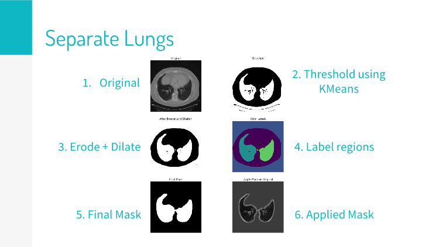

# Lung-Segmentation-Project
Use CT scans of the lungs to generate 3D models of the airway, bronchioles, outer lung structure, and cancerous growths. Mathematical descriptions of these objects can be used for AI research and predicting benign vs malignant tumors.

## DICOM Processing.py
1. Import DICOM images and convert to numpy arrays.
2. Use Kmeans thresholding to display empty space as white and non-empty space as black. 
3. Erode away the finer details and dilate to return to former size.
4. Label regions using python's skimage measure tools.
5. Choose appropriate regions based on length and width, then dilate out mask to make sure it doesn't clip the lungs.
6. Apply mask to each lung slice.

